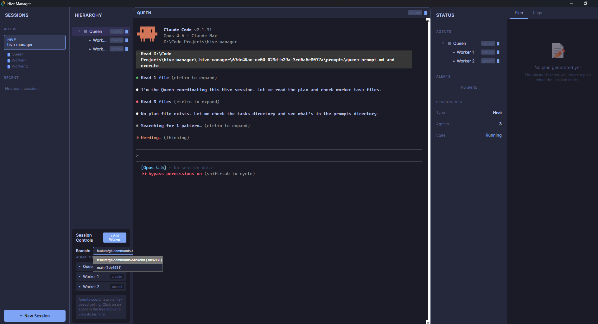

# Hive Manager

A desktop application for orchestrating multi-agent AI coding sessions. Launch coordinated teams of AI coding assistants (Claude, Codex, Gemini, etc.) that work together on complex software tasks.




## Features

- **Hive Mode**: Queen + Workers architecture for coordinated development
- **Swarm Mode**: Hierarchical planners with domain-specific mini-hives
- **Fusion Mode**: Parallel competing implementations with best-pick resolution
- **Session Persistence**: Save and resume sessions across app restarts
- **Multi-CLI Support**: Works with Claude Code, Codex, OpenCode, Gemini CLI, and more
- **Real-time Monitoring**: Watch all agents work simultaneously with live terminal output
- **Git Integration**: Automatic branch management and coordination

## Installation

### Windows

Download the latest release from the [Releases page](https://github.com/rdfitted/hive-manager/releases):

- **NSIS Installer**: `Hive Manager_x.x.x_x64-setup.exe` (recommended)
- **MSI Installer**: `Hive Manager_x.x.x_x64_en-US.msi`

### Build from Source

Requirements:
- Node.js 18+
- Rust 1.70+
- Windows 10/11

```bash
# Clone the repository
git clone https://github.com/rdfitted/hive-manager.git
cd hive-manager

# Install dependencies
npm install

# Development mode
npm run tauri dev

# Production build
npm run tauri build
```

## Quick Start

1. Launch Hive Manager
2. Click **New Session** in the sidebar
3. Select your project directory
4. Choose a session type (Hive, Swarm, or Fusion)
5. Configure your agents (CLI, model, roles)
6. Click **Launch**

## Session Types

### Hive
Traditional Queen + Workers setup. The Queen coordinates and delegates tasks to specialized Workers.

### Swarm
Hierarchical architecture with Planners that each manage their own mini-hive of Workers. Great for large, multi-domain projects.

### Fusion
Launch multiple agents working on the same task in parallel. Compare approaches and pick the best solution.

## Supported CLIs

| CLI | Behavior | Notes |
|-----|----------|-------|
| [Claude Code](https://claude.ai/claude-code) | Action-Prone | Anthropic's official CLI. Needs role hardening for worker agents. |
| [Gemini CLI](https://github.com/google/gemini-cli) | Action-Prone | Google's CLI. Similar behavior to Claude. |
| [Codex](https://github.com/openai/codex) | Explicit-Polling | OpenAI's CLI. Uses bash loops for coordination. |
| [OpenCode](https://github.com/opencode-ai/opencode) | Explicit-Polling | Open-source alternative. |
| [Qwen](https://github.com/QwenLM/qwen-agent) | Instruction-Following | Follows instructions literally, respects role boundaries naturally. |
| [Droid](https://github.com/anthropics/droid) | Interactive | TUI mode with `/model` command for model selection. |
| [Cursor](https://cursor.sh) | Interactive | Runs via WSL. Uses global model setting. |

**Behavior profiles** determine how Hive Manager prompts each agent:
- **Action-Prone**: Proactive agents that need strong constraints to stay in their lane
- **Instruction-Following**: Literal interpreters that respect role boundaries naturally
- **Explicit-Polling**: Agents that need bash loops for coordination
- **Interactive**: TUI-based agents with different prompt injection

## Configuration

Sessions are stored in `%APPDATA%/hive-manager/sessions/`.

App configuration is in `%APPDATA%/hive-manager/config.json`.

## Development

```bash
# Run in development mode with hot reload
npm run tauri dev

# Type checking
npm run check

# Build for production
npm run tauri build
```

## Tech Stack

- **Frontend**: SvelteKit 5, TypeScript
- **Backend**: Rust, Tauri 2
- **Terminal**: xterm.js with PTY support

## Contributing

Contributions are welcome! Please feel free to submit a Pull Request.

## License

MIT License - see [LICENSE](LICENSE) for details.

## Acknowledgments

Built with [Tauri](https://tauri.app/), [SvelteKit](https://kit.svelte.dev/), and [xterm.js](https://xtermjs.org/).
