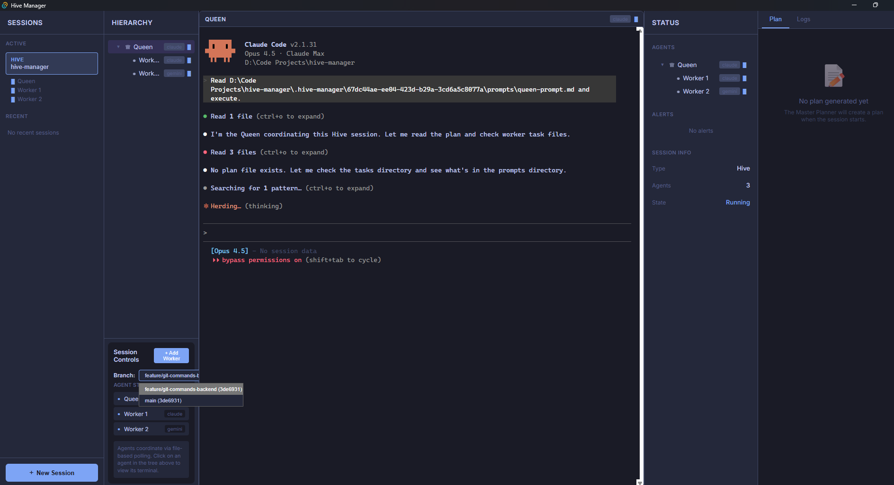

# Hive Manager

A local, operator-controlled meta-harness for AI coding sessions. Launch, supervise, and compare coordinated CLI agents (Claude, Codex, Gemini, Antigravity, and others) without handing topology decisions to an opaque control plane.




## Features

- **Hive Mode**: An Opus Queen coordinates manager-launched coding principals, with capability-aware native delegation inside supported harnesses
- **Fusion Mode**: Parallel competing implementations with best-pick resolution
- **Solo Mode**: One directly supervised coding agent for focused work
- **Legacy Swarm Compatibility**: Existing Swarm sessions remain programmatically launchable outside the primary flow
- **Session Persistence**: Save and resume sessions across app restarts
- **Multi-CLI Support**: Works with Claude Code, Codex, OpenCode, Gemini CLI, Antigravity CLI (agy), and more
- **Real-time Monitoring**: Watch all agents work simultaneously with live terminal output
- **Git Integration**: Automatic branch management and coordination

## Installation

### Windows

Download the latest release from the [Releases page](https://github.com/rdfitted/hive-manager/releases):

- **NSIS Installer**: `Hive Manager_x.x.x_x64-setup.exe` (recommended)
- **MSI Installer**: `Hive Manager_x.x.x_x64_en-US.msi`

### Build from Source

Requirements:
- Node.js 18+
- Rust 1.70+
- Windows 10/11

```bash
# Clone the repository
git clone https://github.com/rdfitted/hive-manager.git
cd hive-manager

# Install dependencies
npm install

# Development mode
npm run tauri dev

# Production build
npm run tauri build
```

## Quick Start

1. Launch Hive Manager
2. Click **New Session** in the sidebar
3. Select your project directory
4. Choose a primary launch type (Hive, Fusion, or Solo)
5. Configure the topology, workspace strategy, agents, and delegation policy
6. Click **Launch**

## Session Types

### Hive
The default managed topology. An Opus Queen coordinates coding principals that Hive Manager launches and displays. A direct new Hive starts with one generic Codex `gpt-5.6-sol` coding principal; built-in feature and bug templates can preconfigure backend and frontend specializations. The operator's CLI, model, and role selections are authoritative.

### Fusion
Launch multiple agents working on the same task in parallel. Compare approaches and pick the best solution.

### Solo
Launch one agent directly when a managed multi-agent topology would add no value.

### Legacy Swarm
Swarm remains programmatically compatible for existing callers and sessions, but it is not part of the primary launch flow.

## Execution Topology

Hive Manager keeps two delegation layers explicit:

- **Managed principals (macro layer)** are launched, displayed, and supervised by Hive Manager. The operator chooses their CLI, canonical model ID, role, workspace, and delegation policy.
- **Native children (micro layer)** may be created inside a capable Claude or Codex harness. They inherit the parent's Assignment Contract and cannot expand its authority, path ownership, or delivery obligations.

`shared_cell` is the recommended workspace strategy for a new collaborative Hive; `isolated_cell` gives each managed principal an explicit worktree when the operator wants separation.

Native delegation policy is separate from capability inference. The current card comes from Hive Manager's CLI adapter profile, not a live binary/version probe: `disabled` always turns delegation off; `auto` permits only adapter-declared support; `encouraged` records explicit operator authorization without rewriting an unknown capability as supported. Optional child and depth values are carried into the assignment as guidance; hard concurrency enforcement remains owned by the native harness.

Canonical model IDs are `gpt-5.6-sol` and `fable`; **GPT-5.6 Sol** and **Fable 5** are display names. Hive Manager normalizes the legacy Codex value `gpt-5.6` at launch so sessions and templates saved by older builds keep working. Older models remain selectable. Built-in defaults are recommendations, never hidden overrides of operator choices.

When Master Planner is used, it is contract-only: it converts the objective into bounded Assignment Contracts and stops before implementation.

## Supported CLIs

| CLI | Behavior | Notes |
|-----|----------|-------|
| [Claude Code](https://claude.ai/claude-code) | Action-Prone | Anthropic's official CLI. Supports native delegation; Opus is the recommended Queen model. |
| [Antigravity CLI](https://www.antigravity.google/docs/cli-using) | Action-Prone | Google's `agy` (successor to Gemini CLI), available for operator-designed and mixed-model teams. Model + verbosity live in `~/.gemini/antigravity-cli/settings.json` — no `--model` flag. After installing `agy`, restart Hive Manager so the spawn environment picks up the new User PATH entry. ⚠️ Known upstream issue [google-antigravity/antigravity-cli#76](https://github.com/google-antigravity/antigravity-cli/issues/76) — `agy -p` silently drops stdout in non-TTY contexts; affects Solo-mode antigravity launches only. Hive worker mode is unaffected. |
| [Gemini CLI](https://github.com/google/gemini-cli) | Action-Prone | Google's legacy CLI. Selectable but **deprecates 2026-06-18**; prefer Antigravity for new work. |
| [Codex](https://github.com/openai/codex) | Explicit-Polling | OpenAI's CLI. Supports native delegation; `gpt-5.6-sol` is the recommended coding-principal model. Hive task activation uses a durable polling loop. |
| [OpenCode](https://github.com/opencode-ai/opencode) | Explicit-Polling | Open-source alternative. |
| [Qwen](https://github.com/QwenLM/qwen-agent) | Instruction-Following | Follows instructions literally, respects role boundaries naturally. |
| [Droid](https://github.com/anthropics/droid) | Interactive | TUI mode with `/model` command for model selection. |
| [Cursor](https://cursor.sh) | Interactive | Runs via WSL. Uses global model setting. |

**Behavior profiles** guide CLI-specific prompt hardening. Capability cards separately report adapter-declared harness support; delegation policy records operator permission.

- **Action-Prone**: Proactive agents that need strong constraints to stay in their lane
- **Instruction-Following**: Literal interpreters that respect role boundaries naturally
- **Explicit-Polling**: Agents that need bash loops for coordination
- **Interactive**: TUI-based agents with different prompt injection

## Configuration

Sessions are stored in `%APPDATA%/hive-manager/sessions/`.

App configuration is in `%APPDATA%/hive-manager/config.json`.

## Development

```bash
# Run in development mode with hot reload
npm run tauri dev

# Type checking
npm run check

# Build for production
npm run tauri build
```

## Tech Stack

- **Frontend**: SvelteKit 5, TypeScript
- **Backend**: Rust, Tauri 2
- **Terminal**: xterm.js with PTY support

## Contributing

Contributions are welcome! Please feel free to submit a Pull Request.

## License

MIT License - see [LICENSE](LICENSE) for details.

## Acknowledgments

Built with [Tauri](https://tauri.app/), [SvelteKit](https://kit.svelte.dev/), and [xterm.js](https://xtermjs.org/).
