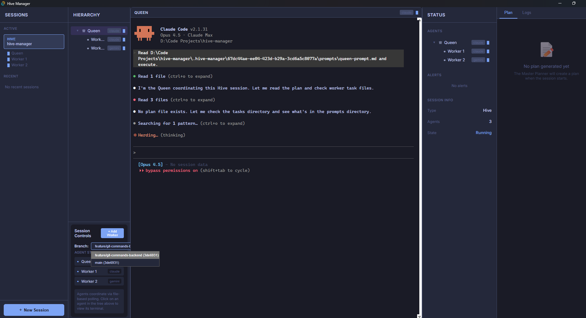

# Hive Manager

A local, operator-controlled meta-harness for AI coding sessions. Launch, supervise, and compare coordinated CLI agents (Claude, Codex, and others) without handing topology decisions to an opaque control plane.




## Features

- **Hive Mode**: An Opus Queen coordinates manager-launched coding principals, with capability-aware native delegation inside supported harnesses
- **Fusion Mode**: Parallel competing implementations with best-pick resolution
- **Solo Mode**: One directly supervised coding agent for focused work
- **Legacy Swarm Compatibility**: Existing Swarm sessions remain programmatically launchable outside the primary flow
- **Session Persistence**: Save and resume sessions across app restarts
- **Multi-CLI Support**: Works with Claude Code, Codex, OpenCode, and more
- **Real-time Monitoring**: Watch all agents work simultaneously with live terminal output
- **Git Integration**: Automatic branch management and coordination

## Installation

### Windows

Download the latest release from the [Releases page](https://github.com/rdfitted/hive-manager/releases):

- **NSIS Installer**: `Hive Manager_x.x.x_x64-setup.exe`

### macOS

Download the universal `.dmg` from the [Releases page](https://github.com/rdfitted/hive-manager/releases), open it, and drag Hive Manager to `/Applications` before launching from Finder. macOS 11 or newer is required. Running the app from the mounted DMG or Downloads can trigger App Translocation and prevent replacement during an update.

If macOS blocks the first launch, open **System Settings → Privacy & Security → Open Anyway**. If that still fails, run this fallback in Terminal and launch the app again:

```bash
xattr -dr com.apple.quarantine "/Applications/Hive Manager.app"
```

App data and configuration are stored under `~/.config/hive-manager`.

### Build from Source

Requirements:
- Node.js 18+
- Rust 1.70+
- Windows 10/11 or macOS 11+

```bash
# Clone the repository
git clone https://github.com/rdfitted/hive-manager.git
cd hive-manager

# Install dependencies
npm install

# Development mode
npm run tauri dev

# Production build
npm run tauri build
```

## Updates

Official Hive Manager installs at v0.55.0 or later check for updates on launch and every six hours. Use the **Check for updates** refresh icon to check manually. When an update is available, choose **Update Now**. The app downloads a signed update and asks before restarting if a session is running.

If you installed Hive Manager before v0.55.0, download and install v0.55.0 once from the official [Releases page](https://github.com/rdfitted/hive-manager/releases). Those older installs cannot update themselves. The in-app update path applies to official Windows and macOS installs. A source clone updates through git, and a fork does not inherit this project's signing key or releases. Local builds must not bump the app version: a local build at a newer or equal version can hide an official update.

## Quick Start

1. Launch Hive Manager
2. Click **New Session** in the sidebar
3. Select your project directory
4. Choose a primary launch type (Hive, Fusion, or Solo)
5. Configure the topology, workspace strategy, agents, and delegation policy
6. Click **Launch**

## Session Types

### Hive
The default managed topology. An Opus Queen coordinates coding principals that Hive Manager launches and displays. A direct new Hive starts with one generic Codex `gpt-6-sol` coding principal; built-in feature and bug templates can preconfigure backend and frontend specializations. The operator's CLI, model, and role selections are authoritative.

### Fusion
Launch multiple agents working on the same task in parallel. Compare approaches and pick the best solution.

### Solo
Launch one agent directly when a managed multi-agent topology would add no value.

### Legacy Swarm
Swarm remains programmatically compatible for existing callers and sessions, but it is not part of the primary launch flow.

## Execution Topology

Hive Manager keeps two delegation layers explicit:

- **Managed principals (macro layer)** are launched, displayed, and supervised by Hive Manager. The operator chooses their CLI, canonical model ID, role, workspace, and delegation policy.
- **Native children (micro layer)** may be created inside a capable Claude or Codex harness. They inherit the parent's Assignment Contract and cannot expand its authority, path ownership, or delivery obligations.

`shared_cell` is the recommended workspace strategy for a new collaborative Hive; `isolated_cell` gives each managed principal an explicit worktree when the operator wants separation.

Native delegation policy is separate from capability inference. The current card comes from Hive Manager's CLI adapter profile, not a live binary/version probe: `disabled` always turns delegation off; `auto` permits only adapter-declared support; `encouraged` records explicit operator authorization without rewriting an unknown capability as supported. Optional child and depth values are carried into the assignment as guidance; hard concurrency enforcement remains owned by the native harness.

Canonical model IDs are `gpt-6-sol` and `fable`; **GPT-6 Sol** and **Fable 5** are display names. Hive Manager normalizes the aliases `gpt-6` to `gpt-6-sol` and legacy `gpt-5.6` to `gpt-5.6-sol` at launch. Sessions and templates saved by older builds keep working. Older models remain selectable. Built-in defaults are recommendations, never hidden overrides of operator choices.

When Master Planner is used, it is contract-only: it converts the objective into bounded Assignment Contracts and stops before implementation.

## Supported CLIs

Claude Code, Codex, OpenCode, Qwen, and Droid use their installed native executables on Windows and macOS when available on `PATH` or configured by absolute path. A Finder launch on macOS also discovers common Homebrew and user CLI directories. Cursor launches through WSL on Windows only; it is unavailable on macOS. Scratch terminals offer PowerShell and Command Prompt on Windows, and the login shell on macOS. Install and authenticate each CLI separately.

| CLI | Behavior | Notes |
|-----|----------|-------|
| [Claude Code](https://claude.ai/claude-code) | Action-Prone | Anthropic's official CLI. Supports native delegation; Opus is the recommended Queen model. |
| [Codex](https://github.com/openai/codex) | Explicit-Polling | OpenAI's CLI. Supports native delegation; the GPT-6 models are `gpt-6-astra` (frontier), `gpt-6-sol` (the recommended coding-principal model), and `gpt-6-luna` (fast). GPT-5.6 presets remain selectable. Hive task activation uses a durable polling loop. |
| [OpenCode](https://github.com/opencode-ai/opencode) | Explicit-Polling | Open-source alternative. |
| [Qwen](https://github.com/QwenLM/qwen-agent) | Instruction-Following | Follows instructions literally, respects role boundaries naturally. |
| [Droid](https://github.com/anthropics/droid) | Interactive | TUI mode with `/model` command for model selection. |
| [Cursor](https://cursor.sh) | Interactive | Runs via WSL on Windows only (unavailable on macOS). Uses global model setting. |

**Behavior profiles** guide CLI-specific prompt hardening. Capability cards separately report adapter-declared harness support; delegation policy records operator permission.

- **Action-Prone**: Proactive agents that need strong constraints to stay in their lane
- **Instruction-Following**: Literal interpreters that respect role boundaries naturally
- **Explicit-Polling**: Agents that need bash loops for coordination
- **Interactive**: TUI-based agents with different prompt injection

## Configuration

On Windows, sessions are stored in `%APPDATA%/hive-manager/sessions/` and app configuration is in `%APPDATA%/hive-manager/config.json`. On macOS, app data and configuration are under `~/.config/hive-manager`.

- `pty_replay_buffer_bytes` (optional): bytes of terminal output retained per agent so a
  freshly mounted pane can replay the agent's current screen. Defaults to 512 KiB; values
  are clamped to 8 KiB..=1 MiB and apply to agents spawned after the app starts.

Local test runs before v0.50.0 leaked fixture sessions into the real session store. To
list them, and then remove them, run against the running app:

```bash
curl -X POST http://127.0.0.1:18800/api/maintenance/purge-fixture-sessions
curl -X POST "http://127.0.0.1:18800/api/maintenance/purge-fixture-sessions?apply=true"
```

Removed: sessions whose project path no longer exists and whose id is not a UUID (or whose
project pointed into the OS temp directory), plus non-UUID session directories whose
`session.json` cannot be read. Everything else is kept, and anything suspicious that was
kept (a live session, a UUID session whose project moved or whose `session.json` is
unreadable) is listed under `skipped` with the reason.

## Knowledge layout

Hive Manager works without a shared wiki or a personal skill directory. The shared wiki is optional context for Atlas and Research and Debate prompts. Each project separately keeps `.ai-docs/` for its own conventions and learnings; the shared wiki can be used across projects.

Choose the wiki root with `HIVE_WIKI_ROOT` for one process, **Atlas → Wiki settings** (`global_wiki_path`) for a saved choice, or the default `~/.ai-docs/wiki`, in that order. A leading `~` means your home directory. Atlas, prompts, and health checks use the same root.

Start by copying [the wiki starter](docs/wiki-starter/) to your chosen root. It includes `index.md` (the page registry), `schema.md` (frontmatter and placement rules), `log.md`, and `patterns/`, `practices/`, `research/`, and `tools/` directories with README stubs. It also includes generic role knowledge templates. Keep `index.md` current as you add pages. A missing `schema.md` falls back to `title`, `category`, and `last_updated` frontmatter.

A project's `.ai-docs/` can contain `project-dna.md`, `bug-patterns.md`, `learnings.jsonl`, `curation-state.json`, `archive/`, and an optional `tiers/ladder.md` override. `roles/` and `tiers/ladder.md` are optional overrides for embedded definitions; Hive Manager uses its embedded roles and tiers when those files are absent. Missing project knowledge files simply provide no context until created.

If the wiki root or its `index.md` is missing, wiki reads and capture steps are skipped. An indexed local wiki supports reading and local writes; Git enables local commits. A Git worktree with an `origin` remote and working `gh auth status` enables the pull request capture flow. The app checks these conditions at each spawn. You can use Atlas without GitHub authentication.

**Privacy:** `knowledge_wiki_folders: null` scans every discoverable wiki folder, while `knowledge_wiki_folders: []` scans none. If your wiki contains private material, set an explicit allowlist of safe folder names in Atlas → Wiki settings before enabling scans. This setting controls what Atlas indexes; it does not replace filesystem access controls. The starter contains no private folders or content.

## Workflow pack

The optional [workflow pack](workflow-pack/) supplies nine portable skills and a generic [agent roster](workflow-pack/agent-roster.md). Edit the roster's CLI and model slots for the tools installed on your machine. The skills use those slots for bounded delegation and explain the native Claude sub-agent fallback when Codex is absent. The repository keeps canonical skills in `workflow-pack/skills/` and checked copies in `.claude/skills/` and `.agents/skills/`.

From the repository root, preview or install the pack for your user account:

```bash
node scripts/install-workflows.mjs --user --harness both --dry-run
node scripts/install-workflows.mjs --user --harness both
```

Use `--harness claude` or `--harness codex` to select one harness. The installer respects `CODEX_HOME`, skips identical files, and preserves differing unowned or locally edited files while reporting them. Its ownership record is `workflow-pack-install.json` in the Hive Manager app config directory. The app does not install skills automatically.

To preview or remove installed pack files:

```bash
node scripts/install-workflows.mjs --user --harness both --uninstall --dry-run
node scripts/install-workflows.mjs --user --harness both --uninstall
```

Uninstall removes only files recorded by the installer whose current hashes still match their install hashes. It reports edited or unowned files for you to handle and leaves other files in those directories alone.

## Development

```bash
# Run in development mode with hot reload
npm run tauri dev

# Type checking
npm run check

# Build for production
npm run tauri build
```

## Tech Stack

- **Frontend**: SvelteKit 5, TypeScript
- **Backend**: Rust, Tauri 2
- **Terminal**: xterm.js with PTY support

## Contributing

Contributions are welcome! Please feel free to submit a Pull Request.

## License

MIT License - see [LICENSE](LICENSE) for details.

## Acknowledgments

Built with [Tauri](https://tauri.app/), [SvelteKit](https://kit.svelte.dev/), and [xterm.js](https://xtermjs.org/).
